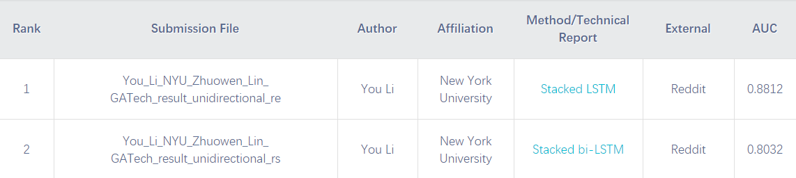
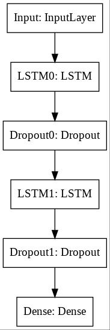

# Melody-Classifier-with-Stacked-LSTM
This is the repository for our code and dataset in AI-Composed Music Recognition Competition held by the [8th Conference on Sound and Music Technology](http://www.csmcw-csmt.cn/). The information about this competition can be found [here](https://ai-composition-recognition2020.github.io/english.html). 

## Collaborator
`You Li`, New York University, yl6911@nyu.edu  
`Zhuowen Lin`, Georgia Institute of Technology, zlin343@gatech.edu  

## Technical Details
According to the results posted [here](https://ai-composition-recognition2020.github.io/english.html), we won the 1st (and 2nd) place of this competition! :trophy:  

Our technical report can be found [here](https://arxiv.org/abs/2010.08123). Our presentation at the 8th Conference on Sound and Music Technology can be found [here](https://drive.google.com/file/d/1KieDt6zXUh6q2JoR-KdGd4h7XxGCVKlA/view?usp=sharing). 
### Dataset
Training data in label 0 (music composed by AI algorithms) are distributed by the committee of this competition. They are 6000 MIDI files with monophonic melodies, tempi between 68 and 118 bpm, and lengths of 8 bars. They contain different music genres and do not necessarily include complete phrase structures. 

Training data in label 1 (music composed by human musicians) are collected from [here](https://www.reddit.com/r/WeAreTheMusicMakers/comments/3ajwe4/the_largest_midi_collection_on_the_internet/). We modify (trim and quantize) around 1000 of them to make them have the similar structures as training data in label 0.  

40% of training data are used for validation. 

Test data with unknown labels are also distributed by the committee of this competition. They consist of 4000 MIDI files. The classification results of test data, output as likelihood score for each melody being AI or human composed, are used for the ranking of this competition.

### Features
The features we choose are the pitch and duration of notes extracted from the melody and their corresponding position (beat) in each bar. 

### Model
We use a stacked-LSTM model, with a similar structure was first introduced by Graves et al. [1] in 2013.  

## Reference
[1] Graves, A., Mohamed, A.r., Hinton, G.: Speech recognition with deep recurrent neural networks. In: 2013 IEEE international conference on acoustics, speech and signal processing, pp. 6645–6649. IEEE (2013)
